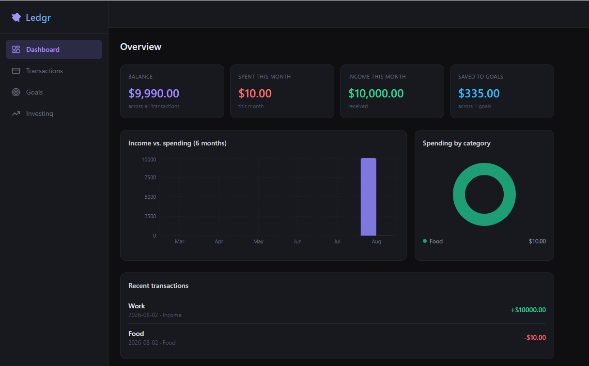
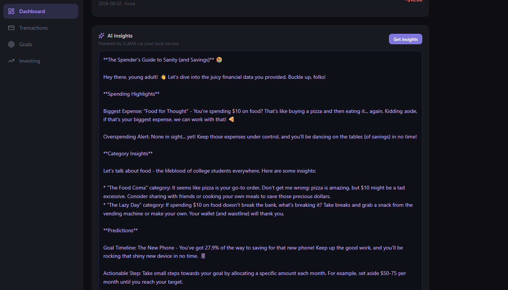
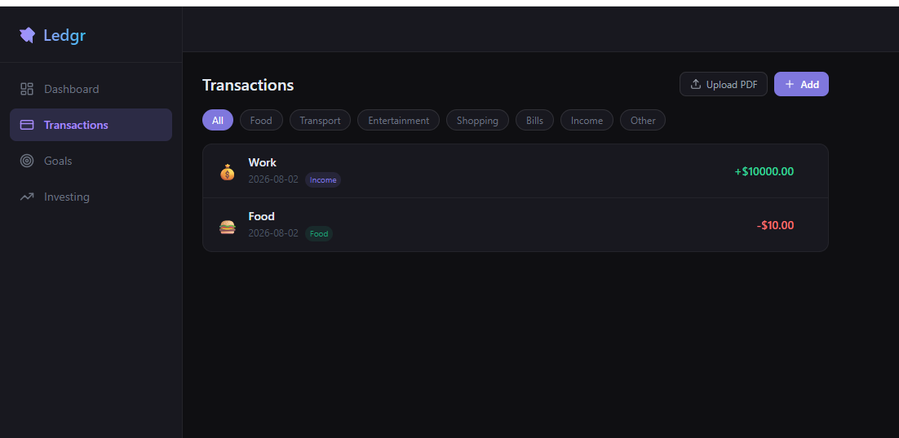
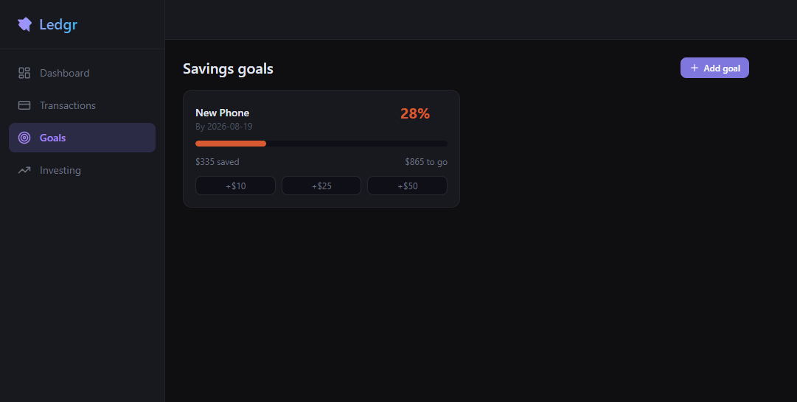

# Ledgr

A personal finance platform built for students by a student. Track spending, set savings goals, monitor investments, and get AI financial insights all in this one place.

## Demo

---

## Features

- **Transaction tracking** — add transactions manually, upload bank statement PDFs, or connect a real bank account via Plaid
- **Smart categorization** — transactions are automatically categorized (Food, Transport, Entertainment, Bills, etc.)
- **Savings goals** — create goals with target amounts, deadlines, and visual progress tracking
- **Investment portfolio** — track stocks, ETFs, and crypto holdings with live price refresh via Alpha Vantage
- **AI financial insights** — personalized financial advice powered by LLaMA 3.2 running locally via Ollama
- **Real-time updates** — all data syncs instantly across the app via Convex's reactive database
- **Secure auth** — email/password authentication with JWT sessions via @convex-dev/auth

---

## Tech Stack

### Frontend
- React 19 + Vite
- Tailwind CSS v4
- Recharts (data visualization)
- Radix UI (accessible components)

### Backend
- Convex (database, serverless functions, authentication)

### Microservices
- Python + Flask — PDF bank statement processor (PDFPlumber)
- Python + Flask — AI insights service (Ollama + LLaMA 3.2)

### External APIs
- Plaid — bank account linking and transaction import
- Alpha Vantage — real time stock and ETF prices
- Ollama — local LLM inference (LLaMA 3.2)

---

## Key Implementation Details

**Real-time data** — Convex's reactive queries mean every component re-renders automatically when data changes so no polling is involved.

**Security** — Every Convex mutation and query verifies the authenticated user via `getAuthUserId()`. Users can only read and modify their own data.

**Microservice architecture** — The PDF and AI services are intentionally decoupled from the frontend. Each runs independently on its own port and communicates via REST, making them easy to swap, scale, or replace.
